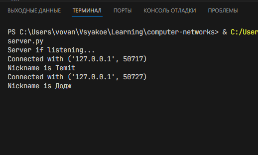
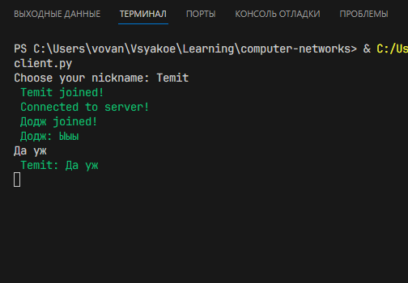
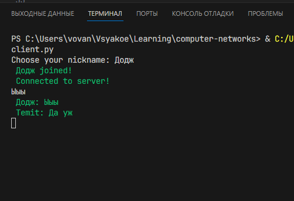
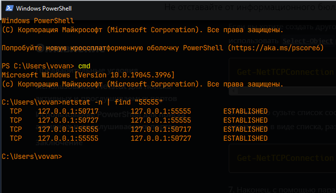

# Домашнее задание к семинару №6

    Напишите свою программу сервер и запустите её (если опыта в python нет, запустите готовый код и разберитесь, как он работает — файл с кодом готового клиента, файл с кодом готового сервера).
    
    ** попробуйте улучшить код, опишите что сделали, какие фичи добавили.

    Запустите несколько клиентов. Сымитируйте чат.

    Отправьте мне код написанного сервера (можете через github, если удобно или прямо здесь в txt формате) и скриншоты работающего чата.

    Отследите сокеты с помощью команды netstat (тоже пришлите скриншот именно сокетов вашего чата).

    Перехватите трафик своего чата в Wireshark и cшейте сессию. Пришлите скриншот сшитой сессии с диалогом.

## Улучшения в __client.py__ и __server.py__

- Добавил в исключения класс `Exception`, по хорошему нужно указывать какое исключение ловим или обозначать как `Exception` для общего отлова, Flake8 правило: E722.

- Изменил кодировку в UTF-8, для поддержки русского языка.

- Изменил местами форматирование текста, убрал аргументы которые идут по умолчанию у функции `socket.socket()` и прочие мелочи, чтоб весь код смотрелся проще( по Пайтонски =) ).

## Screens

